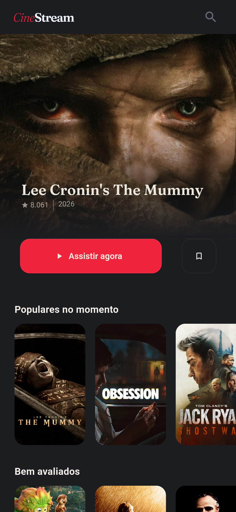
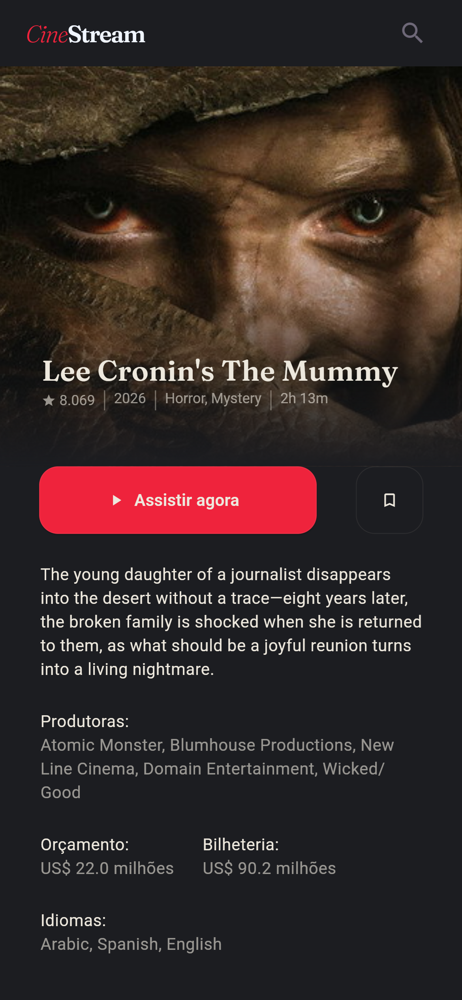

# 




# 🎬 Cine Stream — Desafio Técnico WTF

Aplicativo Flutter desenvolvido como desafio técnico para a vaga de **Desenvolvedor Júnior** na WTF. O app consome a API do [TMDB (The Movie Database)](https://www.themoviedb.org/) para exibir filmes populares e seus detalhes.

---

## 📋 Sumário

- [Como rodar o projeto](#-como-rodar-o-projeto)
- [Gerenciador de estado e bibliotecas](#-gerenciador-de-estado-e-bibliotecas)
- [Arquitetura](#-arquitetura)
- [Estrutura de pastas](#-estrutura-de-pastas)

---

## 🚀 Como rodar o projeto

### Pré-requisitos

- [Flutter SDK](https://docs.flutter.dev/get-started/install) `^3.10.3`
- Dart `^3.10.3`
- Uma chave de API do [TMDB](https://developer.themoviedb.org/docs/getting-started)

### 1. Clone o repositório

```bash
git clone https://github.com/diaszin/desafio-tecnico-wtf.git
cd desafio-tecnico-wtf
```

### 2. Configure as variáveis de ambiente

Crie (ou edite) o arquivo `.env` na raiz do projeto com o seguinte conteúdo:

```env
TMDB_API_KEY=seu_token_bearer_aqui
TMDB_BASE_URL=https://api.themoviedb.org/3
```

> ⚠️ O `TMDB_API_KEY` deve ser o **Bearer Token** (Read Access Token) gerado nas configurações da sua conta TMDB, não a API Key simples.

### 3. Instale as dependências

```bash
flutter pub get
```

### 4. Execute o projeto

```bash
flutter run
```

Para rodar em um dispositivo/emulador específico:

```bash
flutter run -d <device_id>
```

Liste os dispositivos disponíveis com `flutter devices`.

ou

### 5. Rode os testes

```bash
flutter test
```

Executa todos os casos de teste de Widgets e unitários


> **Nota:** A página de login foi feito de forma estática. Basta clicar no botão "Entrar" para ser redirecionado para a tela principal

---

## ✨ Funcionalidades

#### 🎬 Lista de Filmes Populares

Exibe uma lista atualizada dos filmes mais populares, com cards visuais e informações resumidas.

### 🎬 Lista de Filmes Bem Avaliados

Exibe uma lista atualizada dos filmes bem avaliados, com cards visuais e informações resumidas.

#### 🔍 Detalhes do Filme

Ao selecionar um card, o usuário é direcionado para uma tela com as informações completas do filme selecionado.

#### 🌗 Suporte a Dark/Light Mode

A interface se adapta automaticamente ao tema definido nas configurações do sistema.

> **Nota:** No *light mode*, a cor primária foi alterada para azul como exemplo prático do uso dessa funcionalidade.

## 📦 Gerenciador de estado e bibliotecas

### Gerenciamento de Estado

| Pacote                                                      | Versão   | Uso                                                                   |
| ----------------------------------------------------------- | -------- | --------------------------------------------------------------------- |
| [`provider`](https://pub.dev/packages/provider)             | `^6.1.5` | Gerenciamento de estado via `ChangeNotifier` + injeção de dependência |
| [`result_command`](https://pub.dev/packages/result_command) | `^2.2.0` | Padrão Command para operações assíncronas nos ViewModels              |

### Principais Bibliotecas

| Pacote                                                      | Versão    | Finalidade                                             |
| ----------------------------------------------------------- | --------- | ------------------------------------------------------ |
| [`dio`](https://pub.dev/packages/dio)                       | `^5.9.2`  | Cliente HTTP para consumo da API TMDB                  |
| [`go_router`](https://pub.dev/packages/go_router)           | `^17.2.3` | Navegação declarativa e roteamento                     |
| [`result_dart`](https://pub.dev/packages/result_dart)       | `^2.2.0`  | Padrão Result para tratamento de erros sem `try/catch` |
| [`google_fonts`](https://pub.dev/packages/google_fonts)     | `^8.1.0`  | Tipografia customizada                                 |
| [`logger`](https://pub.dev/packages/logger)                 | `^2.7.0`  | Log estruturado e legível em desenvolvimento           |
| [`flutter_dotenv`](https://pub.dev/packages/flutter_dotenv) | `^6.0.1`  | Leitura de variáveis de ambiente via arquivo `.env`    |
| [`shimmer_ai`](https://pub.dev/packages/shimmer_ai)         | `^1.3.0`  | Efeito shimmer para skeleton loading                   |

---

## 🏛️ Arquitetura

O projeto segue o padrão **MVVM (Model-View-ViewModel)** combinado com os princípios **SOLID**, garantindo um código desacoplado, testável e de fácil manutenção.

### Camadas

```
lib/
├── data/           # Camada de dados (infraestrutura)
│   ├── models/     # DTOs / modelos de resposta da API
│   ├── services/   # Interfaces e implementações das chamadas HTTP (Dio)
│   └── repository/ # Implementações concretas dos repositórios
│
├── domain/         # Camada de domínio (regras de negócio)
│   ├── entities/   # Entidades puras do domínio
│   └── repository/ # Contratos (interfaces) dos repositórios
│
├── mapper/         # Conversão entre Models (data) e Entities (domain)
│
├── ui/             # Camada de apresentação
│   └── movie/
│       ├── view_models/ # ViewModels com lógica de apresentação (ChangeNotifier)
│       └── views/       # Widgets / telas
│
├── router.dart     # Configuração de rotas (GoRouter)
└── main.dart       # Entry point + injeção de dependências
```

### Princípios e Padrões Aplicados

- **MVVM** — Views são passivas e reagem ao estado exposto pelos ViewModels via `ChangeNotifier`.
- **Inversão de Dependência (DIP)** — As camadas superiores dependem de abstrações (interfaces), não de implementações concretas.
- **Injeção de Dependência** — Todas as dependências são fornecidas via `Provider` no `main.dart`, sem acoplamento direto entre camadas.
- **Padrão Repository** — A camada `domain` define contratos de repositório; a camada `data` provê as implementações concretas.
- **Padrão Mapper** — Objetos da camada `data` (Models) são convertidos em entidades de domínio (Entities) por meio de Mappers dedicados, isolando cada camada.
- **Padrão Result** (`result_dart`) — Operações que podem falhar retornam `Result<Success, Failure>`, eliminando o uso indiscriminado de `try/catch` e tornando os erros explícitos.
- **Padrão Command** (`result_command`) — Operações assíncronas nos ViewModels são encapsuladas em `Command`, facilitando o controle de estado (loading, success, error) na UI.

### Fluxo de dados

```
View  →  ViewModel  →  Repository (interface)  →  Repository (impl)  →  Service (Dio)  →  API TMDB
         ↑                                         ↑
    ChangeNotifier                              Mapper (Model → Entity)
```

---

## 🗂️ Rotas

| Caminho           | Descrição                    |
| ----------------- | ---------------------------- |
| `/`               | Tela de login                |
| `/home`           | Listagem de filmes populares |
| `/movie/:movieid` | Detalhes de um filme         |

---

## 🏷️ Boas práticas adotadas

- Uso de **tags Git** para versionamento semântico das entregas
- Variáveis sensíveis isoladas em `.env` (não commitado)
  - Separação clara de responsabilidades entre as camadas da aplicação
